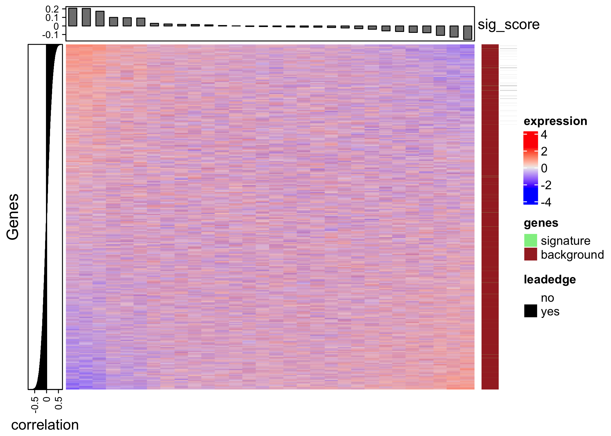
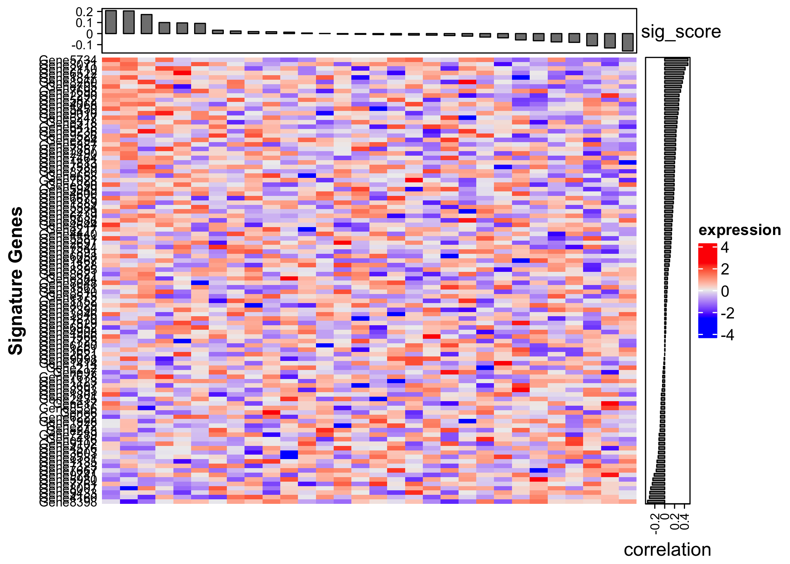
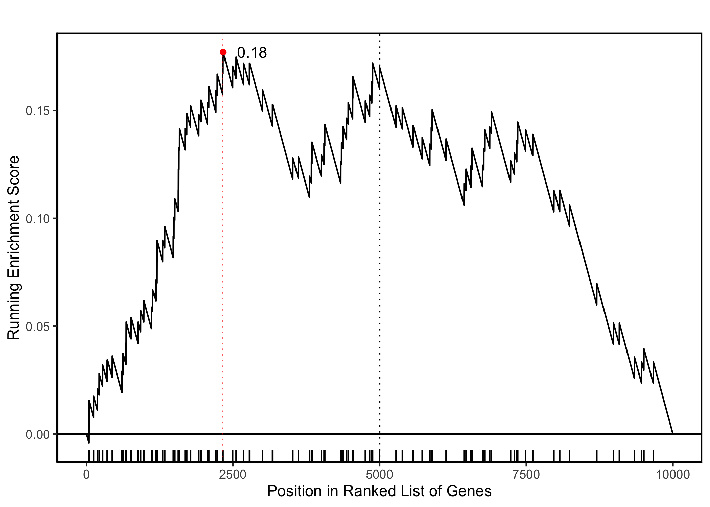

<!-- README.md is generated from README.Rmd. Please edit that file -->

# evalGSVAsig

<!-- badges: start -->
<!-- badges: end -->

It’s common to have a signature of genes, then to give each sample in a
bulk rna-seq dataset a score reflecting the activity of that signature,
such as by GSVA.

The goal of evalGSVAsig is to identify which genes from a signature are
contributing most to the sample signature activity scores across all
samples.

For example, one may have a signature of genes that are upregulated
during the process of epithelial to mesencymal transition (EMT), which
is associated with tumor metastasis. One can use a tool (such as GSVA)
to assign a score to each patient in the TCGA dataset based on each
patient’s gene expression profile, that corresponds to how ‘active’ the
EMT signature is in each patient. It would suggest that a patient with a
higher score has more activity of the genes in the EMT geneset, and thus
may have a more aggressive tumor. Some genes will be very correlated
with the score, suggesting their larger role in EMT in this particular
set of samples, while some genes in the EMT signature may have very
little correlation.

This package simply takes the correlation of each gene in the signature
with the signature score, to identify the genes that are contributing
most to the score.

## Installation

You can install the development version of evalGSVAsig from
[GitHub](https://github.com/) with:

``` r
# install.packages("devtools")
devtools::install_github("montilab/evalGSVAsig@dev")
```

## Example

This is a basic example which shows the format of the data:

``` r
library(evalGSVAsig)

## example gene list
sig <- c("Gene1", "Gene2", "Gene3")
signature_list <- c(list('signature1' = sig))

## run function. if sig_score = NULL, score will be provided. Otherwise provide pre-computed score with sig_score = score
output <- evalGSVAsig::omics_signature_projection(eset = eset, signature = signature_list)

## view output
## data.frame of genes ordered by correlation to signature score
print(output$score_cor)

## data.frame of samples ordered by signature score
print(output$sig_score)

#show heatmap of ALL gene expression in relation to GSVA score
print(output$heatmap_all_genes)

#show heatmap of SIGNATURE gene expression in relation to GSVA score
print(output$heatmap_sig_genes)
```

With sample data:

``` r
#with our sample data
data(signature)
data(eset)

output <- evalGSVAsig::omics_signature_projection(
  eset = eset, 
  signature = signature)
```

View tables:

``` r
## Show some of the genes' correlation to the signature score
print(head(output$score_cor))
#>          score_cor     pval_cor      insig leading_edge
#> Gene329  0.6039086 0.0004099159 background           no
#> Gene7262 0.5914609 0.0005769769 background           no
#> Gene637  0.5795738 0.0007896397 background           no
#> Gene7822 0.5793168 0.0007949097 background           no
#> Gene2907 0.5775437 0.0008321167 background           no
#> Gene5511 0.5719439 0.0009598320 background           no
## Show some of the signature scores
print(head(output$sig_score))
#>           sig_score
#> Sample5  0.20783161
#> Sample9  0.20495746
#> Sample23 0.17228859
#> Sample12 0.09991516
#> Sample11 0.09654342
#> Sample6  0.09226228
```

View heatmap that plots all signature and non-signature genes:

``` r
print(output$heatmap_all_genes)
```



View heatmap that plots only signature genes:

``` r
print(output$heatmap_sig_genes)
```



View k.s. plot of signature genes and scores:

``` r
print(output$ks$plot)
```


