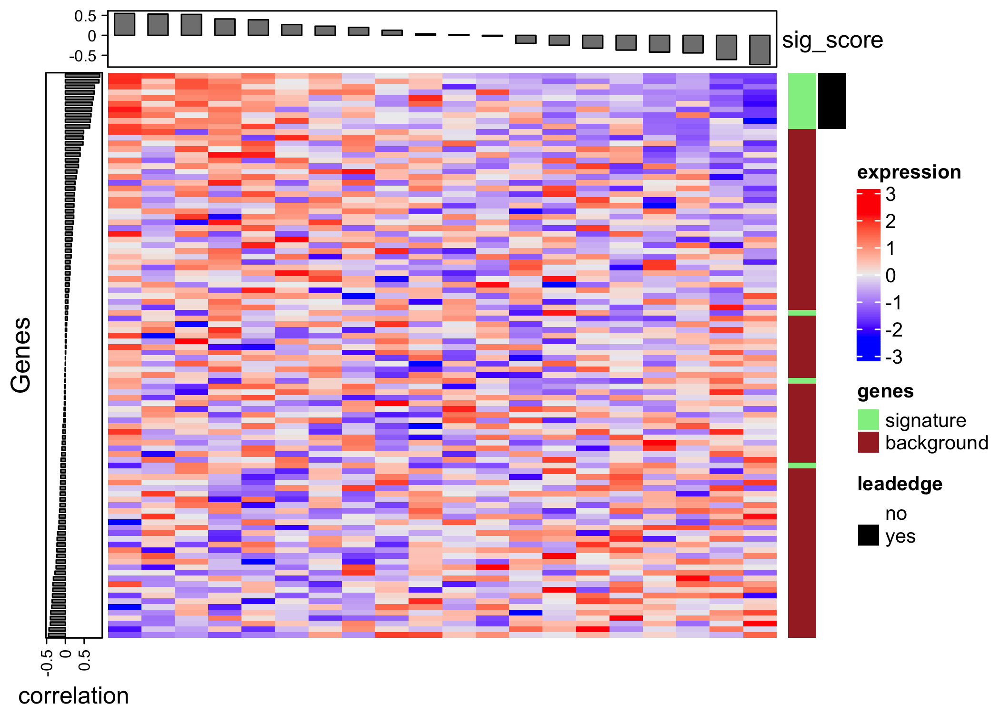
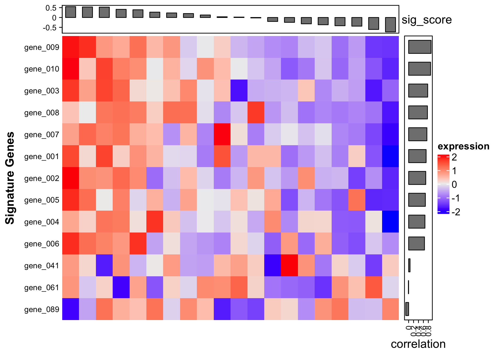
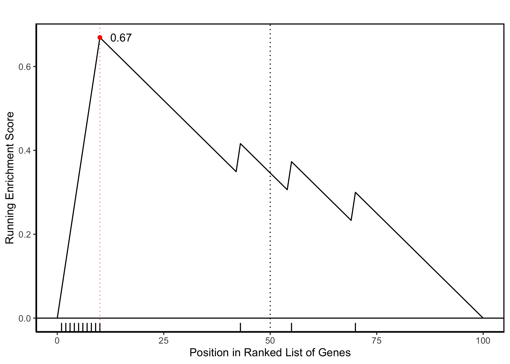
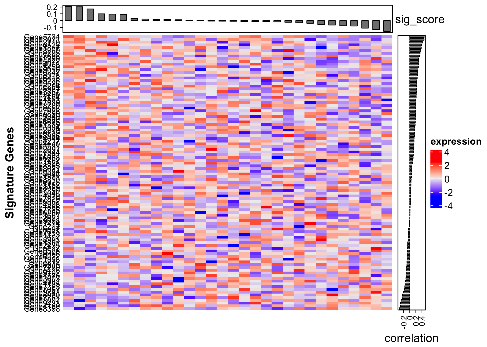
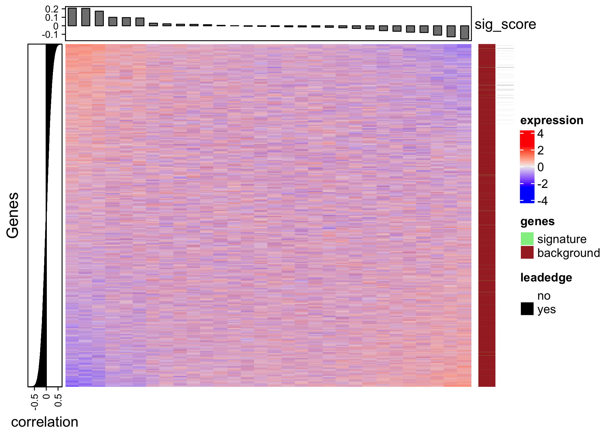
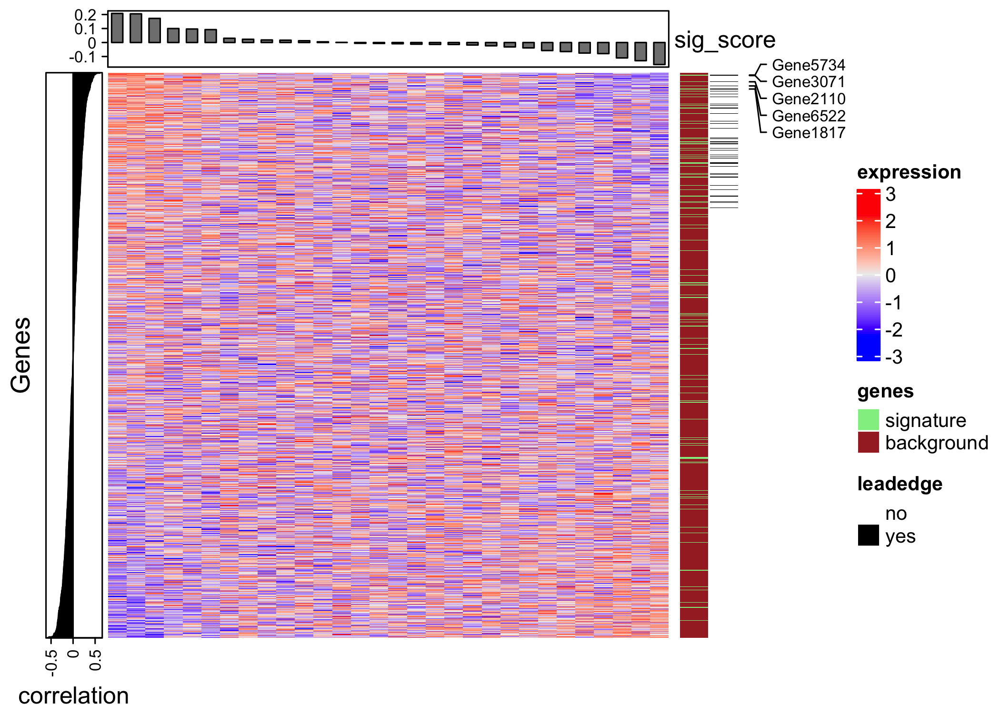
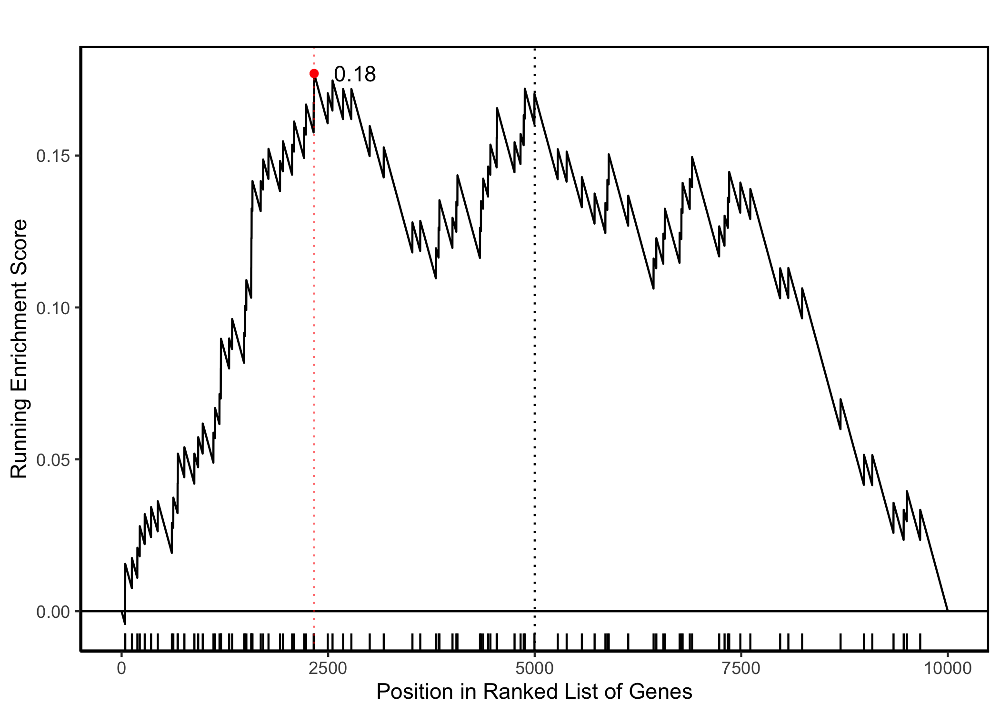

<!-- README.md is generated from README.Rmd. Please edit that file -->

# sigProCon

<!-- badges: start -->

<!-- badges: end -->

It’s common to have a signature of genes, then to give each sample in a
bulk rna-seq dataset a score reflecting the activity of that signature,
such as by GSVA.

The goal of sigProCon is to identify which genes from a signature are
contributing most to the sample signature activity scores across all
samples.

For example, one may have a signature of genes that are upregulated
during the process of epithelial to mesencymal transition (EMT), which
is associated with tumor metastasis. One can use a tool (such as GSVA)
to assign a score to each patient in the TCGA dataset based on each
patient’s gene expression profile, that corresponds to how ‘active’ the
EMT signature is in each patient. It would suggest that a patient with a
higher score has more activity of the genes in the EMT geneset, and thus
may have a more aggressive tumor. Some genes will be very correlated
with the score, suggesting their larger role in EMT in this particular
set of samples, while some genes in the EMT signature may have very
little correlation.

This package simply takes the correlation of each gene in the signature
with the signature score, to identify the genes that are contributing
most to the score. It also supports the visualization of the results as
an annotated heatmap and a KS plot.

## Installation

You can install sigProCon from
[GitHub](https://github.com/) with:

``` r
# install.packages("remotes")
remotes::install_github("montilab/sigProCon")
```

## Example with toy sample data:

sigProCon ships with a small toy signature and toy expression set for
quick experimentation; here we check their sizes:

``` r
data(toy_signature)
data(toy_eset)
print(length(toy_signature))
#> [1] 13
print(dim(toy_eset))
#> Features  Samples 
#>      100       20
```

### View toy data tables:

`signature_projection_contributors()` returns, among other things, each
gene’s correlation to the signature score (`score_cor`) and each
sample’s computed score (`sig_score`):

``` r
toy_output <- sigProCon::signature_projection_contributors(
  eset = toy_eset,
  signature = list(signature1 = toy_signature)
)
## Show some of the genes' correlation to the signature score
print(head(toy_output$score_cor))
#>          score_cor     pval_cor     insig leading_edge
#> gene_009 0.9117601 2.228287e-08 signature          yes
#> gene_010 0.8923537 1.239783e-07 signature          yes
#> gene_003 0.7753862 5.913725e-05 signature          yes
#> gene_008 0.7645522 8.655076e-05 signature          yes
#> gene_007 0.7428196 1.756087e-04 signature          yes
#> gene_001 0.7110160 4.408161e-04 signature          yes

## Show some of the signature scores
print(head(toy_output$sig_score))
#>           sig_score
#> sample_06 0.5496272
#> sample_11 0.5329154
#> sample_03 0.5251103
#> sample_16 0.4113453
#> sample_19 0.3909520
#> sample_07 0.2712722
```

### View toy heatmap that plots all signature and non-signature genes:

`spc_heatmap_all()` draws every gene in the dataset ranked by its
correlation to the signature score, with signature genes and KS
leading-edge hits flagged on the right:

``` r
## plot full heatmap
sigProCon::spc_heatmap_all(
  eset = toy_eset,
  spc_out = toy_output
)
```



### View toy heatmap that plots only signature genes:

`spc_heatmap_sig()` shows the same information restricted to just the
signature genes, which is easier to read when the full gene set is
large:

``` r
## plot signature heatmap
sigProCon::spc_heatmap_sig(
  eset = toy_eset,
  spc_out = toy_output
)
```



### View toy KS plot of signature genes and scores:

The KS plot shows where the signature genes fall along the full ranked
gene list (by correlation to the score) — a peak early in the list means
the signature genes are concentrated among the most correlated genes,
similar to a GSEA enrichment plot:

``` r
print(toy_output$ks$plot)
```



Under the hood, the signature score is computed by
`omics_signature_score()`, which supports three methods: `"GSVA"` (the
default), `"eigengene"` (the module’s first eigengene via WGCNA), and
`"pc"` (a direct principal-component score).

#### Passing a pre-computed score

If you already have a signature score (or want to reuse one across
multiple calls), pass it directly via `sig_score` to skip recomputing
it:

``` r
toy_score <- sigProCon::omics_signature_score(
  eset = toy_eset,
  signature = list(signature1 = toy_signature),
  method = "GSVA"
)
toy_score_eigengene <- sigProCon::omics_signature_score(
  eset = toy_eset,
  signature = list(signature1 = toy_signature),
  method = "eigengene"
)
## call w/ pre-computed score 
toy_output_precomp <- sigProCon::signature_projection_contributors(
  eset = toy_eset,
  signature = list(signature1 = toy_signature),
  sig_score = toy_score
)
## same results
isTRUE(all.equal(toy_output$score_cor, toy_output_precomp$score_cor))
#> [1] TRUE
isTRUE(all.equal(toy_output$sig_score, toy_output_precomp$sig_score))
#> [1] TRUE
```

## Example with package sample data (`eset` and `signature`):

The package also ships a larger, more realistic dataset (`eset` and
`signature`) for demonstration:

``` r
#with our sample data
data(sigProCon::signature)
data(sigProCon::eset)

output <- sigProCon::signature_projection_contributors(
  eset = sigProCon::eset, 
  signature = sigProCon::signature)
```

### View tables:

As with the toy example, `score_cor` and `sig_score` hold the per-gene
correlations and per-sample scores:

``` r
## Show some of the genes' correlation to the signature score
print(head(output$score_cor))
#>          score_cor     pval_cor      insig leading_edge
#> Gene329  0.6039086 0.0004099159 background           no
#> Gene7262 0.5914609 0.0005769769 background           no
#> Gene637  0.5795738 0.0007896397 background           no
#> Gene7822 0.5793168 0.0007949097 background           no
#> Gene2907 0.5775437 0.0008321167 background           no
#> Gene5511 0.5719439 0.0009598320 background           no
## Show some of the signature scores
print(head(output$sig_score))
#>           sig_score
#> Sample5  0.20783161
#> Sample9  0.20495746
#> Sample23 0.17228859
#> Sample12 0.09991516
#> Sample11 0.09654342
#> Sample6  0.09226228
```

### View heatmap that plots only signature genes:

Signature-only view for the full dataset:

``` r
## plot signature heatmap
sigProCon::spc_heatmap_sig(
  eset = sigProCon::eset,
  spc_out = output
)
```



### View heatmap that plots all signature and non-signature genes:

All-genes view for the full dataset:

``` r
## plot full heatmap
sigProCon::spc_heatmap_all(
  eset = sigProCon::eset,
  spc_out = output
)
```



The large number of genes in the dataset makes it difficult to clearly
see the signature hits (*leadedge* on the right). We can subsample the
number of genes to be displayed (to be the union of the top `subsample`
genes by MAD and the signature genes). We can also display the top
correlated genes (using `leadedge_label_n`).

``` r
## plot full heatmap
sigProCon::spc_heatmap_all(
  eset = sigProCon::eset,
  spc_out = output,
  subsample = 3000,
  leadedge_label_n = 5
)
```



### View KS plot of signature genes and scores:

KS plot for the full dataset:

``` r
print(output$ks$plot)
```


